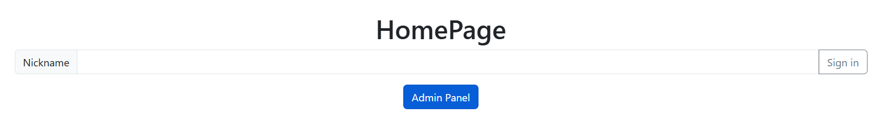
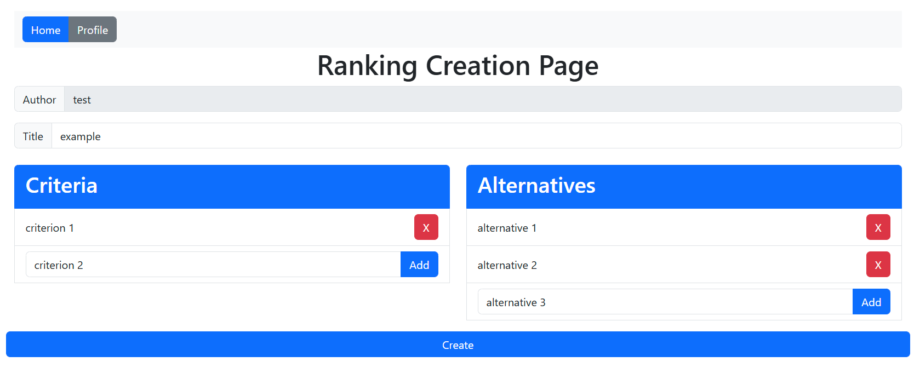
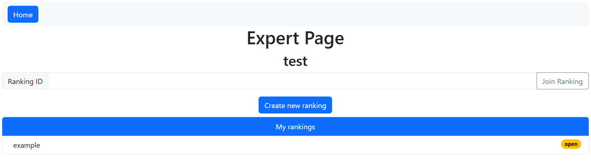
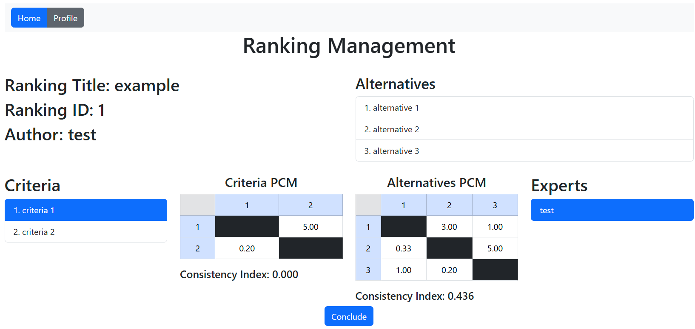
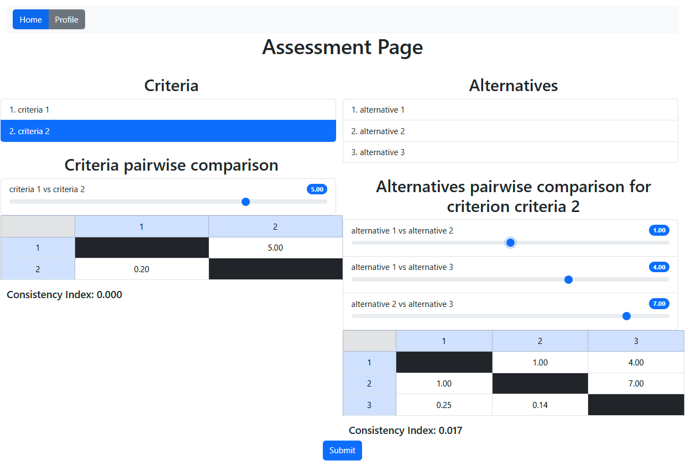
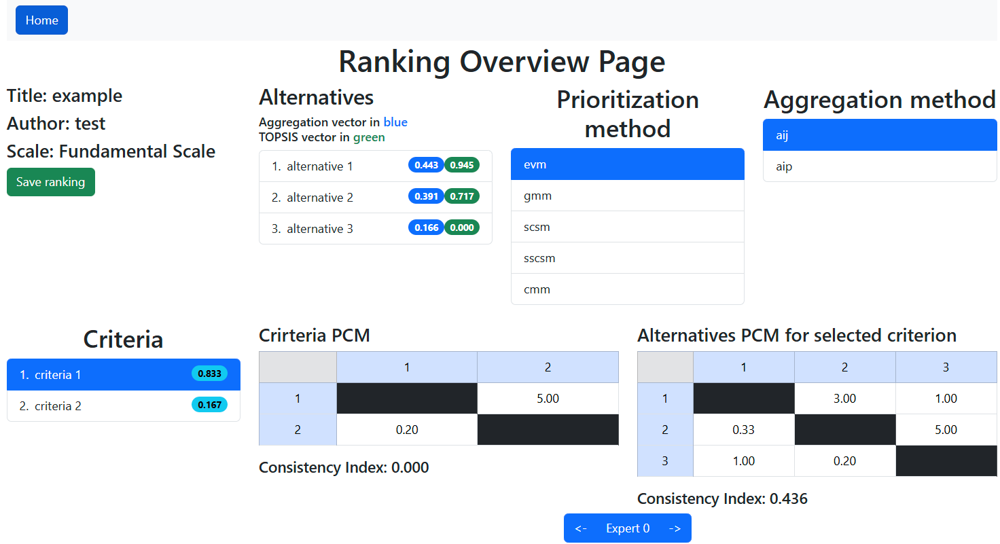
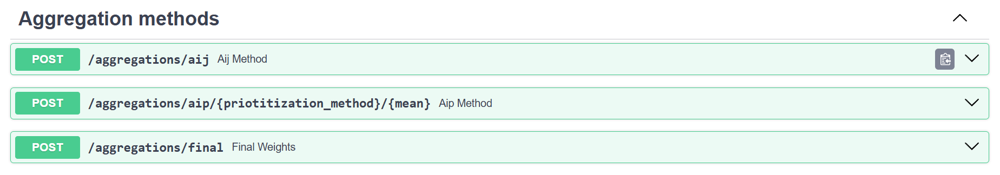
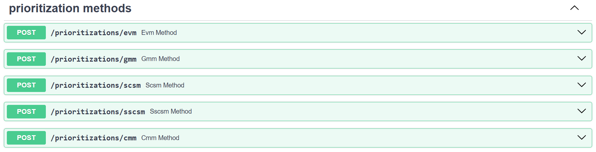
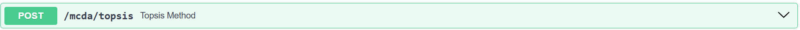
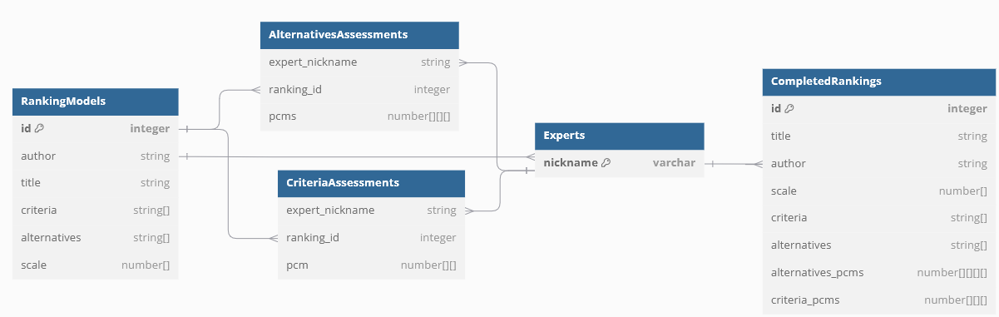

# Application for ranking alternatives using AHP and TOPSIS

## Set Up
### Using docker
1. Clone the repository using `git clone https://github.com/MikolajLH/easy-ranking`
2. Run `docker-compose up` in project root folder.

### From source
1. Clone the repository using `git clone https://github.com/MikolajLH/easy-ranking`
2. Go /server and run `python -m venv env; pip install -r requirements.txt`
3. Go to /client and run `npm i`
4. In order to start the application run `fastapi dev .\src\main.py --port 5000` in the /server folder and `npm run dev` in client folder

## Usage
Aftet starting the application it should be available at http://localhost:5173/.  
The application API's documentation is available at http://localhost:5000/docs/.

---
In order to start using the application you need to sign in with your chosen nickname. After doing that you can join a ranking as an expert or create a new ranking as a faciliator.

When all experts made their assessments, facilitator can conclude the ranking and go to ranking overview page where they can chose aggregation method and prioritization method for calculating the weights of alternatives and critaria.  
The final result can be saved as a json file.

---
All the methods can be easly used by using the REST API.  
These routes does not use database.

## Database model

